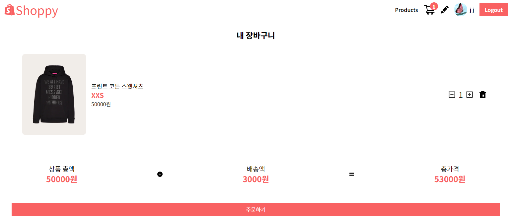
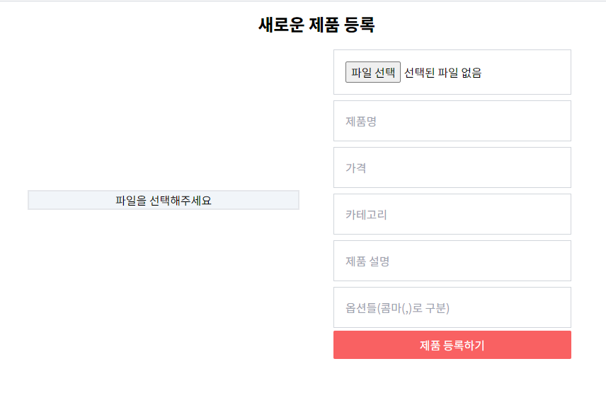

# Shoppy

<a href="https://joohee-shoppy.com/" target="_blank">Shoppy 사이트</a> <br/>
간단한 UI화면을 제공하며 사용자에게 필요한 기능만을 구현한 프로젝트 입니다.<br/>
구글OAuth로 간편하게 회원가입 및 로그인이 가능합니다. Firebase 실시간 데이터베이스를 사용해 사용자 등록과 로그인 계정 확인, 제품 등록이 가능합니다.<br/>

## 기술 스택 및 도구

- React : 웹 애플리케이션 사용자 인터페이스 개발에 사용했습니다.
- React Query : React 애플리케이션의 상태정보를 캐싱, 지속적으로 동기화하고 업데이트하는데 사용했습니다.
- Firebase : 구글 로그인과 회원가입 그리고 장바구니 데이터베이스 저장에 사용했습니다.
- TailwindCSS : 직관적이고 편리한 CSS 코드 작성을 위해 사용했습니다.
- Yarn : 빠른 패키지 설치와 높은 보안성을 위해 사용했습니다.

## 구현 코드 설명

```javascript
export default function ProtectedRoute({ children, requireAdmin }) {
  const { user } = useAuthContext();

  if (!user || (requireAdmin && !user.isAdmin)) {
    return <Navigate to="/" replace />;
  }

  return children;
}
```

```javascript
const router = createBrowserRouter([
  {
    path: '/',
    element: <App />,
    errorElement: <NotFound />,
    children: [
      { index: true, path: '/', element: <Home /> },
      { path: '/products', element: <AllProducts /> },
      {
        path: '/products/new',
        element: (
          <ProtectedRoute requireAdmin>
            <NewProducts />
          </ProtectedRoute>
        ),
      },
      { path: '/products/:id', element: <ProductDetail /> },
      {
        path: '/carts',
        element: (
          <ProtectedRoute>
            <MyCart />
          </ProtectedRoute>
        ),
      },
    ],
  },
]);
```

- 로그인했으며, 로그인한 사용자의 객체의 isAdmin값이 true고 등록된 어드민일 경우에만 제품 등록 아이콘이 보여집니다.

```javascript
export default function useCart() {
  const { uid } = useAuthContext();
  const queryClient = useQueryClient();

  const cartQuery = useQuery({
    queryKey: ['carts', uid || ''],
    queryFn: () => getCart(uid),
    options: {
      enabled: !!uid,
    },
  });

  const addOrUpdateItem = useMutation({
    mutationFn: (product) => addOrUpdateToCart(uid, product),
    onSuccess: () => {
      queryClient.invalidateQueries(['carts', uid]);
    },
  });

  const removeItem = useMutation({
    mutationFn: (id) => removeFromCart(uid, id),
    onSuccess: () => {
      queryClient.invalidateQueries(['carts', uid]);
    },
  });

  return { cartQuery, addOrUpdateItem, removeItem };
}
```

```javascript
    import useCart from '../hooks/useCart';

    export default function MyCart() {
        const {
            cartQuery: { isLoading, data: products },
        } = useCart();
        ...
    }
```

- 제품을 장바구니에 등록하는 로직, 장바구니에 있는 제품을 제거하는 로직에 queryClient와 uid를 불러오는 코드가 중복되었기 때문에 useCart 커스텀을 사용해 공통된 코드를 최소화하고 UI로직과 비즈니스 로직을 분리했습니다.

## 트러블 슈팅과 해결과정

- 발견한 이슈는 깃허브 이슈란에 report하고 해결된 이슈는 closed되었습니다.
- 존재하지 않는 url 접근시 로컬 환경에서는 커스텀한 404 페이지가 노출되었지만 외부 환경에서는 커스텀한 404 페이지가 아닌 Netlify 자체 404페이지가 노출되었습니다. Netlify support forum을 참고해 netlify.toml, \_redirect 등 Netlify빌드 설정 파일을 소스에 추가후 버그를 해결했습니다.

```javascript
addNewProduct(product, url) //
  .then(() => {
    setSuccess('성공적으로 제품이 추가되었습니다.');
    setTimeout(() => {
      setSuccess(null);
    }, 4000);
  });
```

```javascript
export default function useProducts() {
  const queryClient = useQueryClient();

  const productsQuery = useQuery({
    queryKey: ['products'],
    queryFn: fetchProducts,
    staleTime: 1000 * 60,
  });

  const addProduct = useMutation({
    mutationFn: ({ product, url }) => addNewProduct(product, url),
    onSuccess: () => queryClient.invalidateQueries(['products']),
  });

  return { productsQuery, addProduct };
}

addProduct.mutate(
  { product, url },
  {
    onSuccess: () => {
      setSuccess('성공적으로 제품이 추가되었습니다.');
      setTimeout(() => {
        setSuccess(null);
      }, 4000);
    },
  }
);
```

- 새 제품 등록 후 새로고침하지 않으면 새 제품이 전체 제품에 반영되지 않는 현상이 있었습니다. React Query의 useQuery대신 useMutation을 사용해 products 값을 기반으로 전체 제품 객체가 변경될 경우 즉시 업데이트 되도록 수정했습니다.
- 로그인시 Cross-Origin-Opener-Policy policy would block the window.closed call. 오류가 발생합니다.

## 개선 방향 및 추후 개발 방향

- 현재 로그인하지 않은 사용자가 제품을 장바구니에 추가할 경우 window API인 alert()를 사용했지만 추후 컴포넌트 구현시 커스텀 모달이 필요할 것이라고 생각되므로 모달 컴포넌트를 구현해 alert창을 대체할 예정입니다.
- 내비게이션 영역에 계정명을 클릭하면 마이 페이지로 이동하게 구현할 예정입니다.

## 디렉토리 구조

<pre>
📦src
 ┣ 📂api
 ┃ ┣ 📜firebase.js
 ┃ ┗ 📜uploader.js
 ┣ 📂assets
 ┃ ┣ 📜404.jpg
 ┃ ┗ 📜404.webp
 ┣ 📂components
 ┃ ┣ 📂ui
 ┃ ┃ ┗ 📜Button.jsx
 ┃ ┣ 📜Banner.jsx
 ┃ ┣ 📜CartItem.jsx
 ┃ ┣ 📜CartStatus.jsx
 ┃ ┣ 📜Navbar.jsx
 ┃ ┣ 📜PriceCard.jsx
 ┃ ┣ 📜ProductCard.jsx
 ┃ ┣ 📜Products.jsx
 ┃ ┗ 📜User.jsx
 ┣ 📂context
 ┃ ┗ 📜AuthContext.jsx
 ┣ 📂hooks
 ┃ ┣ 📜useCart.jsx
 ┃ ┗ 📜useProducts.jsx
 ┣ 📂pages
 ┃ ┣ 📜AllProducts.jsx
 ┃ ┣ 📜Home.jsx
 ┃ ┣ 📜MyCart.jsx
 ┃ ┣ 📜NewProducts.jsx
 ┃ ┣ 📜NotFound.jsx
 ┃ ┣ 📜ProductDetail.jsx
 ┃ ┗ 📜ProtectedRoute.jsx
 ┣ 📜App.css
 ┣ 📜App.js
 ┣ 📜index.css
 ┗ 📜index.js
  
</pre>

## 설명

1. 로그인하지 않은 사용자의 경우


내비게이션 영역에 Products 와 Login 버튼이 보인다.<br/>
Products와 메인 화면에서 제품 이미지, 정보가 있는 영역을 클릭하면 제품 상세페이지로 이동한다.<br/><br/>

제품 상세페이지에서 '장바구니에 추가' 버튼을 클릭하면 '로그인후 이용해주세요'라는 알림창이 뜨며 장바구니에 추가되지 않는다.

2. 로그인한 일반 사용자의 경우


내비게이션 영역에 Products, 장바구니, 계정사진과 이름 그리고 Logout 버튼이 보인다.<br/>
Logout버튼을 누르면 로그아웃되고 장바구니 정보, 계정 정보가 모두 보이지 않는다.


제품 상세페이지에서 '장바구니에 추가' 버튼을 클릭하면

1. 버튼 위에 '장바구니에 추가되었습니다.'라는 창이뜬다.
2. 내비게이션에 있는 장바구니 현황버튼에 갯수가 추가된다.



장바구니 아이콘을 클릭하면 장바구니 상세페이지로 이동한다.<br/>
장바구니에 담긴 제품이 없으면 '장바구니에 담긴 상품이 없습니다.'라는 화면을 띄워준다.<br/>
장바구니에 제품이 담겨있다면 제품의 금액과 배송비가 합쳐진 총 금액이 보인다.

3. 로그인한 관리자의 경우



일반 사용자가 사용하는 기능에 추가하여 제품 등록 페이지로 이동이 가능하다.<br/>
제품 등록시 제품 이미지, 제품명, 가격, 카테고리, 제품설명, 옵션이 모두 입력되어야 제품 등록이 가능하다.<br/>

## 배포 주소

[https://joohee-shoppy.com/](https://joohee-shoppy.com/)
